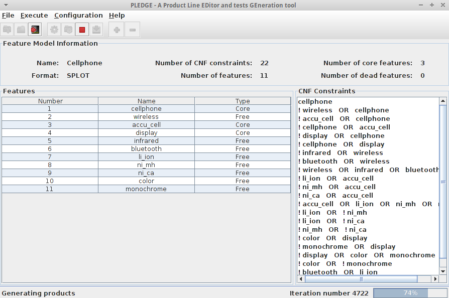
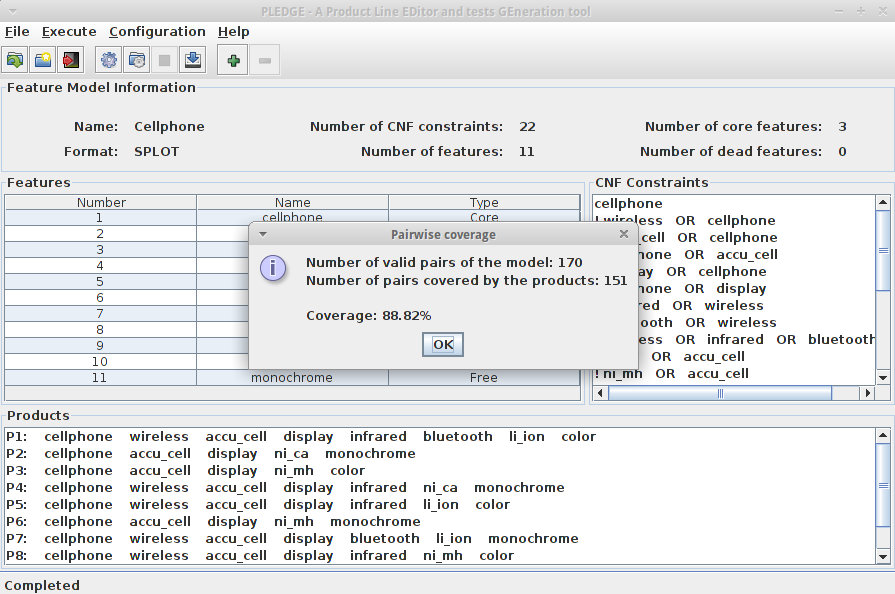

# PLEDGE - A Product Line EDitor and tests GEneration tool
PLEDGE is a testing tool which allows generating and prioritizing products of a Software Product Line. It also allows loading and editing Feature Models.

PLEDGE allows:

* Loading a FM from a file. PLEDGE supports the SPLOT and DIMACS (Conjunctive Normal Form) formats,
* Visualizing the FM information, like the constraints, the list of features or the type of each feature (mandatory, ...),
* Editing the FM, by adding or removing constraints,
* Generate the products to test from the FM, by specifying the number of products desired and the time allowed for generating them,
* Save the generated products to a file,
* Load an arbitrary list of products and prioritize them according to various prioritization techniques.

For more information, check the documentation embedded in the tool or [the online version](http://www.research.henard.net/SPL/PLEDGE/doc/).

The tool uses the [Sat4j](http://www.sat4j.org/), [SPLAR](http://code.google.com/p/splar/) and [JCommander](http://jcommander.org/) libraries.

JavaDoc = https://research.henard.net/SPL/PLEDGE/javadoc/
